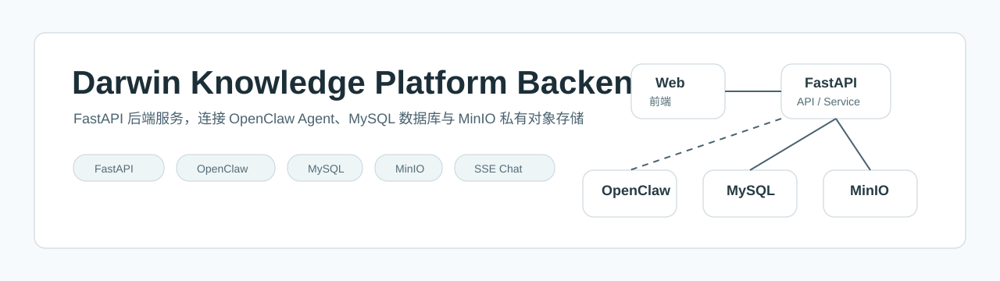
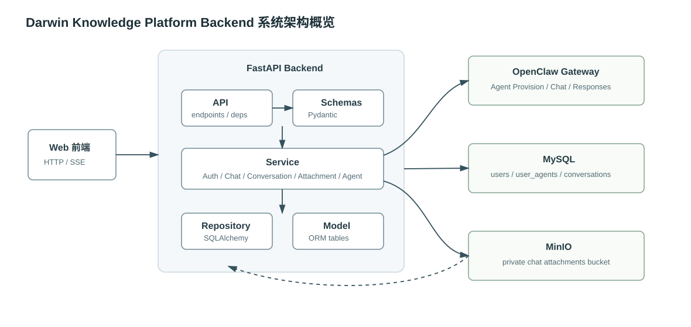
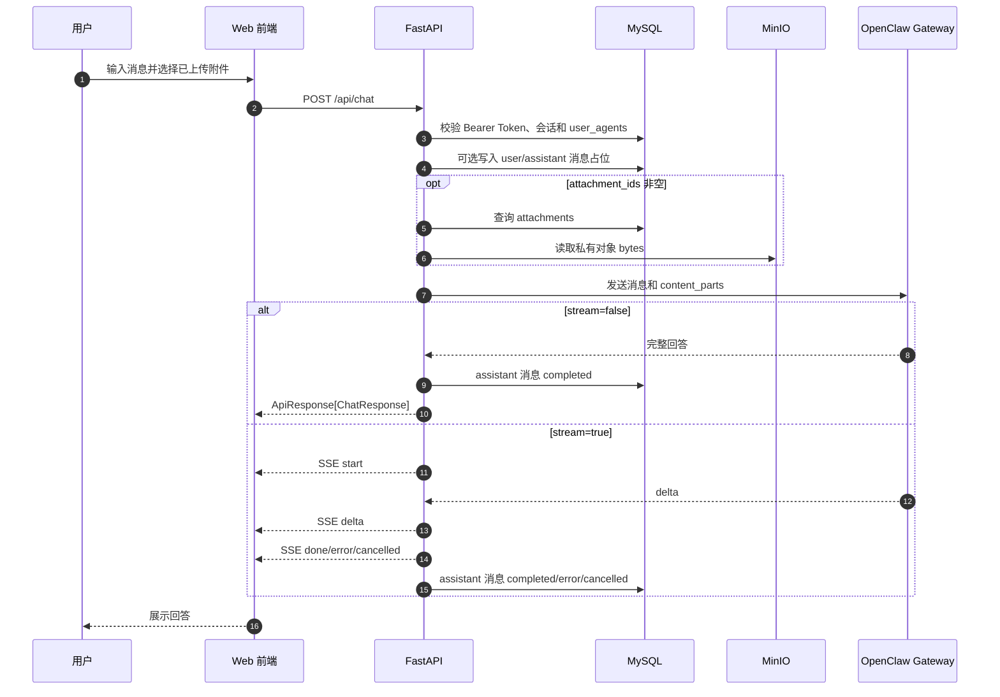

<div align="center">
  

  <h1>Darwin Knowledge Platform Backend</h1>
  <p>基于 FastAPI、OpenClaw、MySQL 和 MinIO 的多用户智能知识平台后端服务。</p>

  <p>
    
    
    
    
    
    
  </p>
</div>

## 项目简介

Darwin Knowledge Platform Backend 是知识平台的 FastAPI 后端。它面向 Web 前端提供用户注册登录、JWT Bearer 鉴权、用户专属 OpenClaw Agent 绑定、会话化聊天、SSE 流式输出、附件上传与私有文件读取等能力。

当前系统的核心链路是：

```text
用户注册/登录
-> FastAPI 完成认证并创建或查询用户专属 OpenClaw Agent
-> 用户创建会话并发送消息，可附带已上传附件
-> FastAPI 校验当前用户、会话、Agent 和附件权限
-> 附件从私有 MinIO 读取并适配为 OpenClaw 输入
-> OpenClaw 返回普通响应或流式增量
-> FastAPI 保存会话消息和附件引用
```

后端保存平台用户、Agent 绑定、会话、消息和附件元数据；MySQL 承担结构化数据持久化；MinIO 保存私有附件对象；OpenClaw Gateway 承担 Agent Provision、运行时就绪检查和聊天推理。

## 核心能力

| 模块 | 状态 | 能力 |
| --- | --- | --- |
| 用户认证 | 已实现 | 注册、登录、JWT Access Token、当前用户查询 |
| Agent 管理 | 已实现 | 用户与 OpenClaw Agent 一对一绑定、注册后 Provision、手动重试、聊天前状态校验 |
| 会话管理 | 已实现 | 创建会话、列表、详情、标题更新、软删除、消息历史 |
| 智能聊天 | 已实现 | 普通响应、SSE 流式响应、停止生成、OpenClaw 错误映射 |
| 附件处理 | 已实现 | multipart 上传、MinIO 私有存储、图片/文本/PDF 输入适配、消息附件引用 |
| 数据持久化 | 已实现 | SQLAlchemy async ORM、Alembic 迁移、MySQL 表结构 |
| 自动化测试 | 已实现 | pytest、FastAPI TestClient、OpenClaw Fake Client、MinIO Fake Storage |
| 管理后台 | 规划中 | 当前没有独立管理后台或 RBAC |
| OCR 和 Office 深度解析 | 规划中 | 当前支持图片、PDF、txt、md、csv、json、html、htm |

## 系统架构



README 只展示高层架构。完整组件说明、分层职责和详细流程见 [系统架构文档](docs/architecture/overview.md)。

## 核心业务流程



当前 SSE 事件名以代码为准：`start`、`delta`、`done`、`error`、`cancelled`。

## 技术栈

| 分类 | 技术 |
| --- | --- |
| Web Framework | FastAPI `0.140.13` |
| ASGI Server | Uvicorn `0.52.0` |
| ORM | SQLAlchemy `2.0.51` async |
| Migration | Alembic `1.16.5` |
| Database | MySQL 8，驱动 `asyncmy` |
| Validation / Settings | Pydantic `2.13.4`, pydantic-settings `2.14.2` |
| Authentication | PyJWT `2.13.0`, pwdlib Argon2 |
| HTTP Client | httpx `0.28.1` |
| Object Storage | MinIO Python SDK `7.2.18` |
| File Processing | Pillow, pypdf, PyMuPDF |
| Streaming | Server-Sent Events, FastAPI `StreamingResponse` |
| Testing | pytest, FastAPI TestClient, SQLite fixture |

依赖版本来自 [requirements.txt](requirements.txt)。

## 目录结构

```text
.
├── app/
│   ├── api/              # API 路由、端点和依赖注入
│   ├── clients/          # OpenClaw Gateway 客户端
│   ├── core/             # 配置、安全、错误、枚举和公共能力
│   ├── integrations/     # MinIO SDK 适配
│   ├── models/           # SQLAlchemy ORM 模型
│   ├── repository/       # 数据访问封装
│   ├── schemas/          # Pydantic 请求和响应模型
│   ├── services/         # 业务逻辑和事务边界
│   └── utils/            # SSE 等工具函数
├── alembic/              # 数据库迁移
├── docs/                 # 项目说明、架构、模块和路线图
├── tests/                # 自动化测试
├── .env.example          # 环境变量示例
├── alembic.ini
├── pytest.ini
├── requirements.txt
└── README.md
```

当前仓库没有 `Dockerfile`、`docker-compose.yml`、`Makefile`、`pyproject.toml` 或 `requirements-dev.txt`。

## 快速开始

### 1. 前置环境

- Python 3.11
- MySQL 8 或兼容版本
- MinIO，本地附件功能需要
- OpenClaw Gateway，注册后 Agent Provision 和聊天需要
- Git

本项目当前以本地 Python 方式启动为主，尚未提供仓库内 Docker Compose 启动流程。

### 2. 获取代码

仓库地址无法从当前工作区确认，以下使用占位符：

```bash
git clone <repository-url>
cd darwin-knowledge-platform/backend
```

### 3. 创建虚拟环境

Windows PowerShell：

```powershell
python -m venv .venv
.\.venv\Scripts\Activate.ps1
python -m pip install --upgrade pip
```

Linux / macOS：

```bash
python -m venv .venv
source .venv/bin/activate
python -m pip install --upgrade pip
```

如果团队本地统一使用 Conda，也可以创建 Python 3.11 环境后继续执行同一套安装命令。

### 4. 安装依赖

```bash
python -m pip install -r requirements.txt
```

### 5. 准备环境变量

Windows PowerShell：

```powershell
Copy-Item .env.example .env
```

Linux / macOS：

```bash
cp .env.example .env
```

编辑 `.env`，至少配置数据库、JWT、OpenClaw 和 MinIO。不要把 `.env` 提交到 Git。

| 变量 | 必填 | 说明 | 示例 |
| --- | --- | --- | --- |
| `APP_ENV` | 否 | 运行环境 | `development` |
| `APP_DEBUG` | 否 | FastAPI debug 开关 | `false` |
| `DB_HOST` | 是 | MySQL host | `127.0.0.1` |
| `DB_PORT` | 是 | MySQL port | `3306` |
| `DB_NAME` | 是 | MySQL database | `darwin_knowledge_platform` |
| `DB_USER` | 是 | MySQL 用户 | `darwin` |
| `DB_PASSWORD` | 是 | MySQL 密码 | `<DB_PASSWORD>` |
| `JWT_SECRET_KEY` | 是 | JWT 签名密钥 | `<JWT_SECRET>` |
| `OPENCLAW_BASE_URL` | 是 | OpenClaw Gateway 地址 | `http://127.0.0.1:18789` |
| `OPENCLAW_GATEWAY_TOKEN` | 是 | OpenClaw Gateway Token | `<OPENCLAW_TOKEN>` |
| `MINIO_ENDPOINT` | 是 | MinIO endpoint | `127.0.0.1:9000` |
| `MINIO_ACCESS_KEY` | 是 | MinIO Access Key | `<MINIO_ACCESS_KEY>` |
| `MINIO_SECRET_KEY` | 是 | MinIO Secret Key | `<MINIO_SECRET_KEY>` |
| `MINIO_BUCKET_CHAT_ATTACHMENTS` | 否 | 聊天附件 bucket | `chat-attachments` |
| `SNOWFLAKE_WORKER_ID` | 否 | Snowflake worker id，范围 0-1023 | `1` |
| `SNOWFLAKE_EPOCH_MS` | 否 | Snowflake 起始毫秒时间戳 | `1767225600000` |

<details>
<summary>展开查看完整环境变量</summary>

```dotenv
APP_NAME=Darwin Knowledge Platform
APP_ENV=development
APP_DEBUG=false
APP_HOST=127.0.0.1
APP_PORT=8000
DOCS_URL=/docs
REDOC_URL=/redoc
LOG_LEVEL=INFO
SQLALCHEMY_LOG_LEVEL=WARNING

DB_HOST=127.0.0.1
DB_PORT=3306
DB_NAME=darwin_knowledge_platform
DB_USER=darwin
DB_PASSWORD=<DB_PASSWORD>
SQL_ECHO=false

JWT_SECRET_KEY=<JWT_SECRET>
JWT_ALGORITHM=HS256
JWT_ACCESS_TOKEN_EXPIRE_MINUTES=120

OPENCLAW_BASE_URL=http://127.0.0.1:18789
OPENCLAW_GATEWAY_TOKEN=<OPENCLAW_TOKEN>
OPENCLAW_CONNECT_TIMEOUT_SECONDS=10
OPENCLAW_READ_TIMEOUT_SECONDS=120
OPENCLAW_WRITE_TIMEOUT_SECONDS=30
OPENCLAW_POOL_TIMEOUT_SECONDS=10

MINIO_ENDPOINT=127.0.0.1:9000
MINIO_ACCESS_KEY=<MINIO_ACCESS_KEY>
MINIO_SECRET_KEY=<MINIO_SECRET_KEY>
MINIO_BUCKET_CHAT_ATTACHMENTS=chat-attachments
MINIO_SECURE=false
MINIO_REGION=

ATTACHMENT_IMAGE_MAX_SIZE=10485760
ATTACHMENT_DOCUMENT_MAX_SIZE=5242880
ATTACHMENT_TOTAL_MAX_SIZE=15728640
ATTACHMENT_MAX_COUNT=4
ATTACHMENT_IMAGE_MAX_PIXELS=40000000
ATTACHMENT_INLINE_TEXT_MAX_CHARS=60000
ATTACHMENT_PDF_MAX_PAGES=20
ATTACHMENT_PDF_TEXT_MIN_CHARS=120
ATTACHMENT_PDF_RENDER_MAX_PAGES=3
ATTACHMENT_PDF_RENDER_ZOOM=1.5

SNOWFLAKE_WORKER_ID=1
SNOWFLAKE_EPOCH_MS=1767225600000
```

</details>

### 6. 准备 MySQL

创建数据库，并使用 `utf8mb4` 字符集。示例：

```sql
CREATE DATABASE darwin_knowledge_platform
  CHARACTER SET utf8mb4
  COLLATE utf8mb4_0900_ai_ci;
```

数据库表由 Alembic 管理，不需要手动建表。

### 7. 执行数据库迁移

```bash
alembic upgrade head
```

如果数据库中已经存在与当前模型一致的历史 `users` 表，应先核对结构，再使用：

```bash
alembic stamp head
```

不要对已经建好同名表的数据库直接执行首次 `upgrade`，否则 Alembic 会尝试重复建表。

### 8. 准备 MinIO

附件上传和聊天附件引用依赖 MinIO。`StorageService.ensure_bucket()` 会在上传对象前检查并创建 `MINIO_BUCKET_CHAT_ATTACHMENTS` 配置的 bucket。该 bucket 应保持私有，浏览器和 OpenClaw 都不直接访问 MinIO URL。

如果只调试健康检查、认证以外的纯本地逻辑，可以暂时不启动 MinIO；一旦使用 `/api/attachments` 或带附件聊天，就需要 MinIO 可用。

### 9. 准备 OpenClaw Gateway

OpenClaw Gateway 需要提前运行，并在 `.env` 中配置 `OPENCLAW_BASE_URL` 和 `OPENCLAW_GATEWAY_TOKEN`。当前后端会调用：

- `POST /api/internal/agent-provisioner/provision`
- `POST /api/v1/admin/rpc`，method 为 `agents.runtime.ensureReady`
- `POST /v1/chat/completions`
- `POST /v1/responses`

Provision 成功响应按当前代码只要求公开字段，例如：

```json
{
  "agent_id": "web-user-123"
}
```

不要在 OpenClaw 响应或后端文档中暴露 `workspace_path`、`agent_dir` 等内部目录字段。

### 10. 启动服务

```bash
uvicorn app.main:app --reload --host 127.0.0.1 --port 8000
```

启动后访问：

| 入口 | 地址 |
| --- | --- |
| API Root | `http://127.0.0.1:8000/` |
| Swagger UI | `http://127.0.0.1:8000/docs` |
| ReDoc | `http://127.0.0.1:8000/redoc` |
| Liveness | `http://127.0.0.1:8000/health/live` |
| Readiness | `http://127.0.0.1:8000/health/ready` |

`/health/live` 不访问外部依赖；`/health/ready` 会检查数据库。

## 快速验证

### 健康检查

```bash
curl http://127.0.0.1:8000/health/live
```

### 注册用户

注册会创建用户和默认 `user_agents` 记录，并尝试调用 OpenClaw Provision。

```bash
curl -X POST "http://127.0.0.1:8000/api/auth/register" \
  -H "Content-Type: application/json" \
  -d '{
    "username": "demo_user",
    "password": "ReplaceWithStrongPassword",
    "display_name": "Demo User",
    "email": "demo@example.com"
  }'
```

### 登录

登录字段名是 `account`，可以传 username 或 phone。

```bash
curl -X POST "http://127.0.0.1:8000/api/auth/login" \
  -H "Content-Type: application/json" \
  -d '{
    "account": "demo_user",
    "password": "ReplaceWithStrongPassword"
  }'
```

### 创建会话

```bash
curl -X POST "http://127.0.0.1:8000/api/conversations" \
  -H "Authorization: Bearer <ACCESS_TOKEN>" \
  -H "Content-Type: application/json" \
  -d '{
    "title": "演示会话"
  }'
```

### 普通聊天

```bash
curl -X POST "http://127.0.0.1:8000/api/chat" \
  -H "Authorization: Bearer <ACCESS_TOKEN>" \
  -H "Content-Type: application/json" \
  -d '{
    "conversation_id": "<CONVERSATION_UUID>",
    "message": "你好，请简单介绍一下当前系统。",
    "stream": false
  }'
```

无 `conversation_id` 的聊天也可以调用，但不会持久化消息历史。

### SSE 流式聊天

```bash
curl -N -X POST "http://127.0.0.1:8000/api/chat" \
  -H "Authorization: Bearer <ACCESS_TOKEN>" \
  -H "Content-Type: application/json" \
  -d '{
    "conversation_id": "<CONVERSATION_UUID>",
    "message": "请用三句话说明这个项目的用途。",
    "stream": true
  }'
```

`curl -N` 用于关闭缓冲，便于观察 SSE 增量。当前接口是 POST 流式响应，前端应使用 `fetch` 或同等能力读取响应流；不要假设浏览器原生 `EventSource` 能直接发起 POST。

### 上传附件并在聊天中引用

```bash
curl -X POST "http://127.0.0.1:8000/api/attachments" \
  -H "Authorization: Bearer <ACCESS_TOKEN>" \
  -F "file=@./example.pdf" \
  -F "conversation_id=<CONVERSATION_UUID>" \
  -F "purpose=chat_attachment"
```

然后在 `/api/chat` 中传入返回的 `attachment_id`：

```json
{
  "conversation_id": "<CONVERSATION_UUID>",
  "message": "请总结这个附件。",
  "attachment_ids": ["<ATTACHMENT_UUID>"],
  "stream": false
}
```

## API 路径速览

| 方法 | 路径 | 说明 |
| --- | --- | --- |
| `GET` | `/` | API 根路径 |
| `GET` | `/health/live` | 进程存活检查 |
| `GET` | `/health/ready` | 数据库就绪检查 |
| `POST` | `/api/auth/register` | 注册 |
| `POST` | `/api/auth/login` | 登录 |
| `GET` | `/api/auth/me` | 当前用户 |
| `POST` | `/api/conversations` | 创建会话 |
| `GET` | `/api/conversations` | 会话列表 |
| `GET` | `/api/conversations/{conversation_id}/messages` | 消息历史 |
| `POST` | `/api/chat` | 普通或 SSE 聊天 |
| `POST` | `/api/chat/{request_id}/cancel` | 停止流式生成 |
| `POST` | `/api/attachments` | 上传附件 |
| `GET` | `/api/attachments/{attachment_id}/content` | 鉴权后读取附件内容 |
| `GET` | `/api/user-agents/me` | 当前用户 Agent |
| `POST` | `/api/user-agents/me/provision` | 当前用户 Agent 手动 Provision |
| `GET` | `/api/v1/users` | User 管理列表，当前未接入鉴权 |
| `GET` | `/api/v1/user-agents` | UserAgent 管理列表，当前未接入鉴权 |

完整 OpenAPI 文档请访问 `/docs`。

## 测试

运行全部测试：

```bash
pytest
```

运行单个测试文件：

```bash
pytest tests/test_chat.py
```

当前测试通过 `tests/conftest.py` 使用 SQLite 文件数据库、`FakeOpenClawClient` 和 `FakeStorageService`。根 README 的旧版测试说明曾要求 `TEST_DATABASE_URL` 和独立 MySQL 测试库，但当前测试代码并未使用该环境变量。

本次 README 改造后已执行：

```text
pytest
179 passed, 2 warnings in 22.77s
```

两个 warning 来自第三方库的 deprecation warning，不是项目测试失败。

## 项目文档

| 文档 | 说明 |
| --- | --- |
| [文档首页](docs/README.md) | 项目文档索引和推荐阅读顺序 |
| [系统架构](docs/architecture/overview.md) | 系统边界、组件关系和请求流转 |
| [数据库设计](docs/architecture/database.md) | 核心表、关系、索引与迁移策略 |
| [外部依赖](docs/architecture/external-integrations.md) | OpenClaw、MinIO、MySQL 和本地文件处理依赖 |
| [错误处理](docs/architecture/error-handling.md) | 异常模型和错误映射 |
| [测试说明](docs/architecture/testing.md) | 测试策略与执行方式 |
| [认证模块](docs/modules/auth.md) | 注册、登录和 JWT 鉴权 |
| [用户模块](docs/modules/users.md) | User CRUD 和当前限制 |
| [OpenClaw Agent](docs/modules/openclaw-agents.md) | 用户 Agent Provision 与绑定 |
| [会话模块](docs/modules/conversations.md) | 会话和消息持久化 |
| [聊天模块](docs/modules/chat.md) | 普通与 SSE 流式聊天 |
| [附件模块](docs/modules/attachments.md) | MinIO、文件解析和消息附件 |
| [演进规划](docs/roadmap/improvements.md) | 后续功能和优先级 |

## 开发规范

- 业务逻辑优先放在 `app/services/`，Endpoint 保持轻量。
- 数据查询封装在 `app/repository/`，避免在 Endpoint 中直接写复杂 SQL。
- 请求和响应结构放在 `app/schemas/`，不要在路由中临时拼复杂响应。
- 数据表变更必须同步更新 ORM、Alembic 迁移、测试 fixture 和文档。
- 新增配置项时同步更新 `.env.example` 和 README 配置说明。
- 涉及 OpenClaw、MinIO、JWT、数据库密码的值必须走环境变量，不写入代码、测试输出或文档。
- 新增用户可见错误时优先使用 `AppError` 或其子类，并保证错误信息安全。

## 当前实现状态

| 能力 | 状态 |
| --- | --- |
| 用户注册与登录 | 已实现 |
| JWT Bearer 鉴权 | 已实现 |
| 用户专属 OpenClaw Agent | 已实现 |
| Agent 运行时就绪检查 | 已实现 |
| 会话与消息持久化 | 已实现 |
| SSE 流式聊天 | 已实现 |
| 停止生成 | 已实现 |
| MinIO 文件上传 | 已实现 |
| PDF 文本提取和图片兜底 | 已实现 |
| Word/Excel/PPT 深度解析 | 规划中 |
| OCR | 规划中 |
| 文件病毒扫描 | 规划中 |
| 分布式流式状态 | 规划中 |
| 管理后台和 RBAC | 规划中 |

## Roadmap

详细优先级见 [演进规划](docs/roadmap/improvements.md)。

- P0：补齐管理接口鉴权、修正 User CRUD 创建逻辑、统一测试数据库说明、强化敏感信息脱敏审计。
- P1：增加 refresh token、登录失败限制、Agent Provision 自动重试和状态同步、聊天中断恢复、上下文裁剪。
- P2：增加 OCR、Office 文件解析、文件预览、大文件异步解析、附件解析缓存、对象生命周期管理和会话搜索。
- P3：建设管理后台、分布式流式状态、Agent Provision 队列化和审计历史。

## 常见问题

### 为什么用户 ID 在 JSON 和 JWT 中使用字符串？

`users.id` 是 63-bit Snowflake ID。为了避免浏览器 JavaScript 大整数精度丢失，API JSON 和 JWT `sub` 都使用十进制字符串。

### 为什么附件存储在 MinIO，而不是数据库？

数据库只保存附件元数据和消息引用关系，文件二进制保存在私有 MinIO bucket，便于控制对象生命周期、避免数据库膨胀，并保持文件访问统一鉴权。

### 浏览器能直接访问 MinIO 对象吗？

当前设计不允许。前端通过 `/api/attachments/{attachment_id}/content` 读取文件，FastAPI 先验证当前用户，再从 MinIO 取 bytes 并转发。

### OpenClaw Agent 创建失败后怎么办？

注册失败不会回滚平台用户，`user_agents.provision_status` 会标记为 `failed`。用户登录后可调用 `POST /api/user-agents/me/provision` 手动重试。

### 为什么聊天有时没有历史记录？

`POST /api/chat` 只有传入 `conversation_id` 时才会写入 `conversation_messages`。无会话聊天是临时请求，不会自动创建会话。

### 数据库表应该手动创建吗？

不建议手动建表。正常开发和部署应使用 `alembic upgrade head` 管理表结构。

## Snowflake ID

`users.id` 由 FastAPI 应用生成，使用 63-bit Snowflake 布局：41 位时间戳、10 位 worker、12 位序列。默认配置：

```dotenv
SNOWFLAKE_WORKER_ID=1
SNOWFLAKE_EPOCH_MS=1767225600000
```

`1767225600000` 表示 2026-01-01 00:00:00 UTC。该值一旦用于生产数据，不应再修改。多实例部署时必须为每个独立应用实例分配不同的 `SNOWFLAKE_WORKER_ID`；在没有 worker-id 分配方案前，不建议用多个 Uvicorn worker 共享同一个 worker id。

## 安全说明

- 不要提交 `.env`、JWT Secret、MinIO Access Key、MinIO Secret Key 或 OpenClaw Gateway Token。
- 生产环境必须替换 `.env.example` 中的示例值和默认弱密钥。
- 生产环境应关闭 `APP_DEBUG`，并按部署网关限制来源、网络访问和日志权限。
- 不要在日志中输出完整 Token、密码、文件内容或 OpenClaw 内部路径。
- 不要向客户端返回 `workspace_path`、`agent_dir`、`knowledge_path` 等内部目录信息。
- MinIO bucket 应保持私有，文件访问由 FastAPI 鉴权后转发。
- `/api/v1/users` 和 `/api/v1/user-agents` 当前未接入鉴权，不应直接暴露到不可信网络。

## License 与维护信息

当前仓库未发现 License 文件。对外发布前请补充许可证、维护团队、代码所有权和贡献流程。
