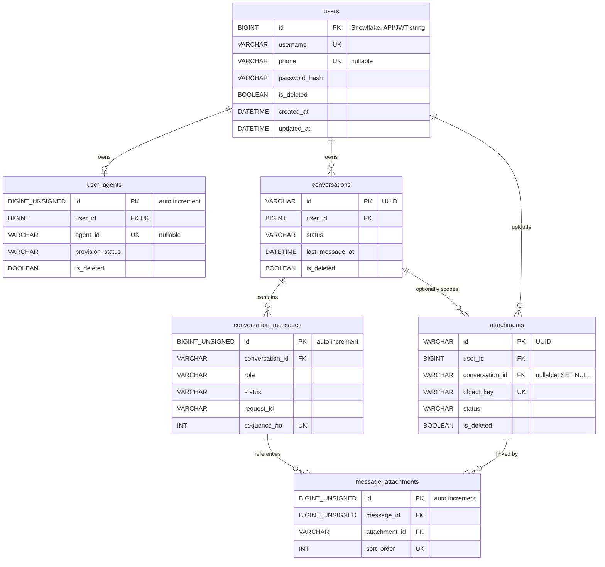

# 数据库设计

## 1. 概述

当前 ORM 使用 SQLAlchemy 2.x Declarative Model，生产配置使用 MySQL 8 和 `mysql+asyncmy`。Alembic 迁移位于 `alembic/versions/`，当前核心表包括 `users`、`user_agents`、`conversations`、`conversation_messages`、`attachments` 和 `message_attachments`。

## 2. ORM Model 与表

| ORM Model | 表名 | 职责 |
| --- | --- | --- |
| `User` | `users` | 平台用户、登录身份和密码哈希 |
| `UserAgent` | `user_agents` | 用户与 OpenClaw Agent 的一对一绑定 |
| `Conversation` | `conversations` | 用户聊天会话 |
| `ConversationMessage` | `conversation_messages` | 会话内消息 |
| `Attachment` | `attachments` | 附件元数据和对象存储定位 |
| `MessageAttachment` | `message_attachments` | 消息与附件的有序关联 |

## 3. ER 图

ER 图只展示关系字段和关键约束，完整字段见下方表格。

## 4. 字段说明

### `users`

| 字段 | 类型 | 约束 | 说明 |
| --- | --- | --- | --- |
| `id` | `BigInteger` | PK, non-autoincrement | 应用生成 Snowflake ID |
| `username` | `String(64)` | not null, `uk_users_username` | 登录用户名 |
| `phone` | `String(32)` | nullable, `uk_users_phone` | 手机号，可登录 |
| `display_name` | `String(128)` | not null | 展示名称 |
| `email` | `String(255)` | nullable | 邮箱 |
| `password_hash` | `String(255)` | not null | Argon2 哈希 |
| `created_by` / `updated_by` | `String(64)` | not null | 审计字段 |
| `created_at` / `updated_at` | `DATETIME(3)` | not null | 审计时间 |
| `is_deleted` | `Boolean` | not null | 逻辑删除 |

### `user_agents`

| 字段 | 类型 | 约束 | 说明 |
| --- | --- | --- | --- |
| `id` | unsigned `BIGINT` | PK, autoincrement | 主键 |
| `user_id` | `BigInteger` | FK `users.id`, unique | 平台用户 ID |
| `agent_id` | `String(128)` | nullable, unique | OpenClaw Agent ID |
| `runtime_type` | `String(32)` | default `shared` | 运行时类型 |
| `runtime_id` | `String(255)` | nullable | 运行时标识 |
| `provision_status` | `String(32)` | default `pending` | Provision 状态 |
| `provision_error` | `String(1000)` | nullable | 安全错误摘要 |
| 审计和软删除字段 | 同 mixin | | `AuditMixin`, `SoftDeleteMixin` |

### `conversations`

| 字段 | 类型 | 约束 | 说明 |
| --- | --- | --- | --- |
| `id` | `String(36)` | PK | UUID |
| `user_id` | `BigInteger` | FK `users.id` | 所属用户 |
| `title` | `String(100)` | default `新对话` | 会话标题 |
| `status` | `String(32)` | default `active` | 当前仅 `active` |
| `last_message_at` | `DATETIME(3)` | nullable | 排序用最后消息时间 |
| 审计和软删除字段 | 同 mixin | | `AuditMixin`, `SoftDeleteMixin` |

### `conversation_messages`

| 字段 | 类型 | 约束 | 说明 |
| --- | --- | --- | --- |
| `id` | unsigned `BIGINT` | PK, autoincrement | 消息 ID |
| `conversation_id` | `String(36)` | FK `conversations.id` | 所属会话 |
| `role` | `String(32)` | not null | `user`、`assistant`、`system` |
| `content` | `Text` | not null | 消息内容 |
| `status` | `String(32)` | default `pending` | 消息状态 |
| `request_id` | `String(36)` | nullable, indexed | SSE 请求 ID |
| `sequence_no` | `Integer` | unique with `conversation_id` | 会话内顺序 |
| `error_message` | `String(1000)` | nullable | 安全错误摘要 |
| 审计字段 | 同 mixin | | 没有 `is_deleted` |

### `attachments`

| 字段 | 类型 | 约束 | 说明 |
| --- | --- | --- | --- |
| `id` | `String(36)` | PK | UUID |
| `user_id` | `BigInteger` | FK `users.id` | 所属用户 |
| `conversation_id` | `String(36)` | nullable, FK `conversations.id`, on delete set null | 可选会话范围 |
| `original_filename` | `String(255)` | not null | 清洗后的原始文件名 |
| `bucket_name` | `String(128)` | not null | MinIO bucket |
| `object_key` | `String(512)` | unique | MinIO object key |
| `content_type` | `String(128)` | not null | 响应 MIME |
| `detected_mime_type` | `String(128)` | not null | 服务端检测 MIME |
| `extension` | `String(16)` | not null | 小写扩展名 |
| `file_size` | `BigInteger` | not null | 字节数 |
| `sha256` | `String(64)` | not null, indexed | 文件摘要 |
| `category` | `String(32)` | not null | `image` 或 `document` |
| `purpose` | `String(64)` | default `chat_attachment` | 用途 |
| `status` | `String(32)` | default `uploading` | 附件状态 |
| `error_message` | `Text` | nullable | 安全错误 |
| 审计和软删除字段 | 同 mixin | | `AuditMixin`, `SoftDeleteMixin` |

### `message_attachments`

| 字段 | 类型 | 约束 | 说明 |
| --- | --- | --- | --- |
| `id` | unsigned `BIGINT` | PK, autoincrement | 主键 |
| `message_id` | unsigned `BIGINT` | FK `conversation_messages.id` | 用户消息 ID |
| `attachment_id` | `String(36)` | FK `attachments.id` | 附件 ID |
| `sort_order` | `Integer` | unique with `message_id` | 附件顺序 |
| `created_at` | `DATETIME(3)` | not null | 创建时间 |

## 5. 索引和约束

| 名称 | 表 | 字段 | 用途 |
| --- | --- | --- | --- |
| `uk_users_username` | `users` | `username` | 用户名唯一 |
| `uk_users_phone` | `users` | `phone` | 手机唯一 |
| `uk_user_agents_user_id` | `user_agents` | `user_id` | 用户一对一 Agent |
| `uk_user_agents_agent_id` | `user_agents` | `agent_id` | Agent 不重复绑定 |
| `ix_conversations_user_deleted_last_message` | `conversations` | `user_id,is_deleted,last_message_at` | 会话列表 |
| `uk_conversation_messages_conversation_sequence` | `conversation_messages` | `conversation_id,sequence_no` | 会话内消息顺序 |
| `ix_conversation_messages_request_id` | `conversation_messages` | `request_id` | 流式请求追踪 |
| `uq_attachments_object_key` | `attachments` | `object_key` | 对象存储定位唯一 |
| `ix_attachments_user_status_deleted` | `attachments` | `user_id,status,is_deleted` | 用户附件查询 |
| `ix_attachments_conversation` | `attachments` | `conversation_id` | 会话附件查询 |
| `ix_attachments_sha256` | `attachments` | `sha256` | 摘要查询 |
| `uk_message_attachments_message_attachment` | `message_attachments` | `message_id,attachment_id` | 防重复关联 |
| `uk_message_attachments_message_sort` | `message_attachments` | `message_id,sort_order` | 附件顺序唯一 |
| `ix_message_attachments_attachment` | `message_attachments` | `attachment_id` | 附件引用计数 |

## 6. Snowflake ID 和大整数

`users.id` 使用 `SnowflakeGenerator`，布局为 41 位时间、10 位 worker、12 位序列，最大值限制在 signed BIGINT 内。配置项：

- `SNOWFLAKE_WORKER_ID`
- `SNOWFLAKE_EPOCH_MS`

HTTP 层的用户 ID 使用 `SnowflakeId`，输入可接受正整数或十进制字符串，输出序列化为字符串。JWT `sub` 同样保存字符串形式 user id。

`conversation_messages.id`、`user_agents.id` 和 `message_attachments.id` 使用 MySQL unsigned BIGINT 自增。消息响应中的 `ConversationMessageRead.id` 会序列化为字符串。

## 7. 数据生命周期

- 用户、UserAgent、会话和附件支持逻辑删除。
- 消息当前不支持逻辑删除，会话软删除不会删除消息。
- 附件删除只允许未被消息引用的附件；已引用附件保留。
- MinIO 对象删除和数据库软删除目前在同一服务方法中串行执行，不是跨系统分布式事务。

## 8. Alembic 迁移策略

当前迁移链：

1. `20260730_00_create_initial_user_tables.py`：创建初始 `users` 和 `user_agents`，历史上包含 OpenClaw 内部路径字段。
2. `20260730_01_make_user_agent_id_nullable.py`：允许 pending 绑定无 `agent_id`。
3. `20260731_01_snowflake_user_ids_and_minimal_user_agents.py`：把用户 ID 改为 BIGINT，移除 `workspace_path`、`agent_dir`、`knowledge_path`。
4. `20260731_02_user_agent_provision_statuses.py`：把历史 `creating` 默认值迁到 `pending`。
5. `20260801_01_conversations_and_messages.py`：新增会话和消息。
6. `20260801_02_chat_attachments.py`：新增附件和消息附件关联。

新增字段或表的建议流程：

1. 修改 ORM Model 和 Schema。
2. 编写 Alembic 迁移，明确 upgrade/downgrade。
3. 对已有表优先做兼容迁移，必要时加 `_has_table()`、`_has_column()` 防护。
4. 补充测试 fixture schema。
5. 更新本文档和模块文档。

## 9. 测试数据库注意事项

根 README 当前写的是独立 MySQL 测试库和 `TEST_DATABASE_URL`，但当前 `tests/conftest.py` 实际使用 session 级 SQLite 文件，并手写建表 SQL。这个差异应后续统一。

