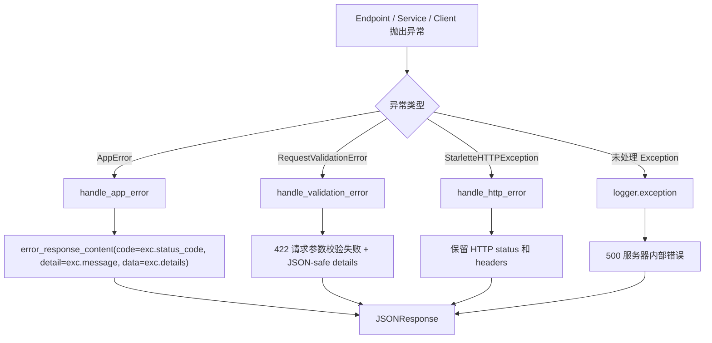

# 错误处理

## 1. 概述

项目通过 `AppError` 表示可安全返回给客户端的业务错误，通过全局异常处理器统一输出 `ApiResponse` 失败结构。OpenClaw 相关异常先在客户端层归类，再由业务服务映射为 `AppError`。

## 2. 错误响应结构

```json
{
  "code": 400,
  "msg": "error",
  "detail": "错误描述",
  "data": []
}
```

`error_response_content()` 在 `data` 为空时返回空数组 `[]`，不是 `null`。

## 3. 异常类型

| 类型 | 说明 |
| --- | --- |
| `AppError` | 可安全映射为 HTTP 响应的应用错误基类 |
| `ResourceNotFoundError` | 404 资源不存在 |
| `ResourceConflictError` | 409 唯一性、状态或并发冲突 |
| `AuthenticationError` | 401 认证失败，带 `WWW-Authenticate: Bearer` |
| `OpenClawTimeoutError` | OpenClaw 超时 |
| `OpenClawConnectionError` | OpenClaw 网络连接失败 |
| `OpenClawAuthenticationError` | OpenClaw 鉴权失败 |
| `OpenClawConflictError` | OpenClaw 状态冲突 |
| `OpenClawRequestError` | OpenClaw 拒绝请求 |
| `OpenClawResponseError` | OpenClaw 响应无效或失败 |
| `OpenClawRuntimeNotReadyError` | Agent runtime 未就绪 |

## 4. 异常到响应流程



全局处理器注册在 `app/core/errors.py`，由 `app/main.py` 的 `register_exception_handlers(application)` 调用。

## 5. OpenClaw 错误映射

普通聊天中，`ChatService._map_openclaw_error()` 将 OpenClaw 异常映射为客户端错误：

| OpenClaw 异常 | code | HTTP 状态 |
| --- | --- | --- |
| `OpenClawTimeoutError` | `openclaw_timeout` | 504 |
| `OpenClawConnectionError` | `openclaw_unavailable` | 503 |
| `OpenClawAuthenticationError` / `OpenClawConfigurationError` | `openclaw_authentication_failed` | 502 |
| `OpenClawRequestError` | `openclaw_request_rejected` | 502 |
| `OpenClawConflictError` | `openclaw_conflict` | 409 |
| rate limited 响应 | `openclaw_rate_limited` | 429 |
| not found 响应 | `openclaw_agent_unavailable` | 502 |
| HTTP 5xx 响应 | `openclaw_service_error` | 502 |
| 其他响应异常 | `openclaw_response_invalid` | 502 |

`OpenClawRuntimeNotReadyError` 会额外把用户 Agent 标记为 `warming`，并返回 `agent_runtime_not_ready`，HTTP 503。

## 6. MinIO 和附件错误

MinIO 上传失败时，如果对象尚未写入，返回 `attachment_storage_failed`，HTTP 503；如果对象已写入但数据库提交失败，会尝试删除对象作为补偿。对象读取和删除阶段的底层异常当前没有专门映射，可能进入全局 500。

## 7. 流式响应中的错误

SSE 由 `app/api/endpoints/chat.py` 输出。事件包括：

- `start`
- `delta`
- `done`
- `error`
- `cancelled`

在流式生成中捕获到 `AppError` 时，后端发送：

```text
event: error
data: {"request_id":"...","code":"OPENCLAW_STREAM_ERROR","message":"..."}
```

随后会把 assistant 消息最终态写成 `error`，并保存安全错误摘要。

## 8. 日志原则

当前代码在 OpenClaw Provision、聊天、异常处理和附件清理失败时记录日志。日志中应继续避免输出真实 token、密码、MinIO 凭证、OpenClaw 内部目录和完整敏感文件内容。

## 9. 当前限制

- 没有统一业务错误码枚举文件，错误码分散在各 Service。
- MinIO 读取/删除错误尚未细分为 404、503 等业务错误。
- SSE 的 `error.code` 当前固定为 `OPENCLAW_STREAM_ERROR`，没有透出更细的业务码。

