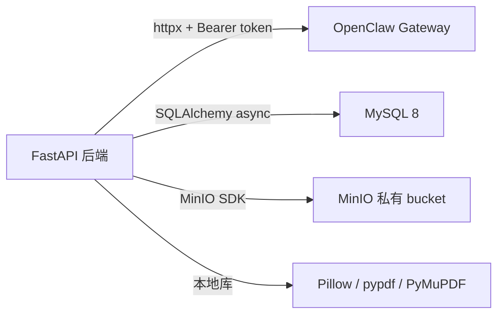

# 外部依赖与集成

## 1. 概述

当前外部依赖包括 OpenClaw Gateway、MySQL 和 MinIO。PDF 与图片处理依赖 Python 本地库，不是外部网络服务。

## 2. OpenClaw Gateway

| 项 | 当前实现 |
| --- | --- |
| 客户端 | `app/clients/openclaw_client.py` |
| Base URL | `OPENCLAW_BASE_URL` |
| 鉴权 | `Authorization: Bearer <OPENCLAW_GATEWAY_TOKEN>` |
| Provision 路径 | `/api/internal/agent-provisioner/provision` |
| Chat 路径 | `/v1/chat/completions` |
| Responses 路径 | `/v1/responses` |
| Admin RPC 路径 | `/api/v1/admin/rpc` |
| Ready 方法 | `agents.runtime.ensureReady` |

超时配置：

- `OPENCLAW_CONNECT_TIMEOUT_SECONDS`
- `OPENCLAW_READ_TIMEOUT_SECONDS`
- `OPENCLAW_WRITE_TIMEOUT_SECONDS`
- `OPENCLAW_POOL_TIMEOUT_SECONDS`

错误映射先发生在 `OpenClawClient`，例如 401/403 映射为 `OpenClawAuthenticationError`，超时映射为 `OpenClawTimeoutError`；聊天服务再将其映射为面向客户端的 `AppError`。

## 3. MinIO

| 项 | 当前实现 |
| --- | --- |
| 客户端 | `app/integrations/minio_client.py` |
| 适配服务 | `app/services/storage_service.py` |
| Bucket | `MINIO_BUCKET_CHAT_ATTACHMENTS`，默认 `chat-attachments` |
| 权限假设 | 私有 bucket |
| 对象写入 | `put_object()` 前自动 `ensure_bucket()` |
| 对象读取 | `get_object_bytes()` |
| 对象删除 | `delete_object()` |

附件接口不会返回 MinIO URL，只返回后端内容接口 `/api/attachments/{attachment_id}/content`。

## 4. MySQL

| 项 | 当前实现 |
| --- | --- |
| 驱动 | `mysql+asyncmy` |
| URL 构造 | `Settings.database_url` |
| Session | 每请求一个 `AsyncSession` |
| 连接池 | `pool_pre_ping=True`, `pool_size=5`, `max_overflow=10`, `pool_recycle=3600` |
| 迁移 | Alembic |

配置项包括 `DB_HOST`、`DB_PORT`、`DB_NAME`、`DB_USER`、`DB_PASSWORD` 和 `SQL_ECHO`。

## 5. 本地文件处理依赖

| 依赖 | 用途 |
| --- | --- |
| Pillow | 图片格式和像素校验 |
| pypdf | PDF 文本抽取 |
| PyMuPDF | PDF 文本不足时渲染页面为 PNG |

当前没有 OCR 服务。若未来接入 OCR，应明确其调用方向、鉴权、超时、重试和数据脱敏策略。

## 6. Fake Client 与 Mock

测试中使用依赖覆盖替换外部服务：

- `tests/conftest.py` 中的 `FakeOpenClawClient` 替换 `get_openclaw_client()`。
- `FakeStorageService` 替换附件服务中的 MinIO 存储。
- OpenClaw 客户端单元测试使用 `httpx.MockTransport`。
- 默认测试数据库 fixture 使用 SQLite 文件。

## 7. 敏感信息保护

- `.env` 不应提交。
- 文档只列环境变量名和用途，不写真实值。
- OpenClaw token 不应出现在异常、日志或响应中。
- `workspace_path`、`agent_dir`、`knowledge_path` 已从当前 ORM 和响应中移除，不应重新暴露。

## 8. 当前限制和建议

- OpenClaw 调用没有自动重试，建议先对幂等的 readiness check 和 provision retry 设计退避策略。
- MinIO 对象删除与数据库提交不是原子事务，建议后续增加补偿任务。
- 当前就绪检查只检查数据库，没有覆盖 MinIO 和 OpenClaw。

