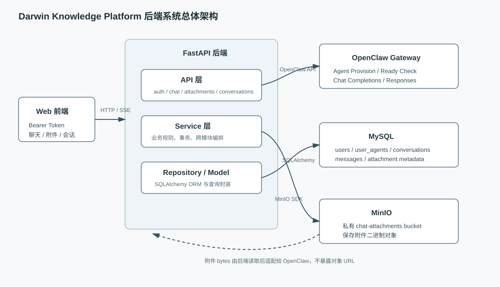
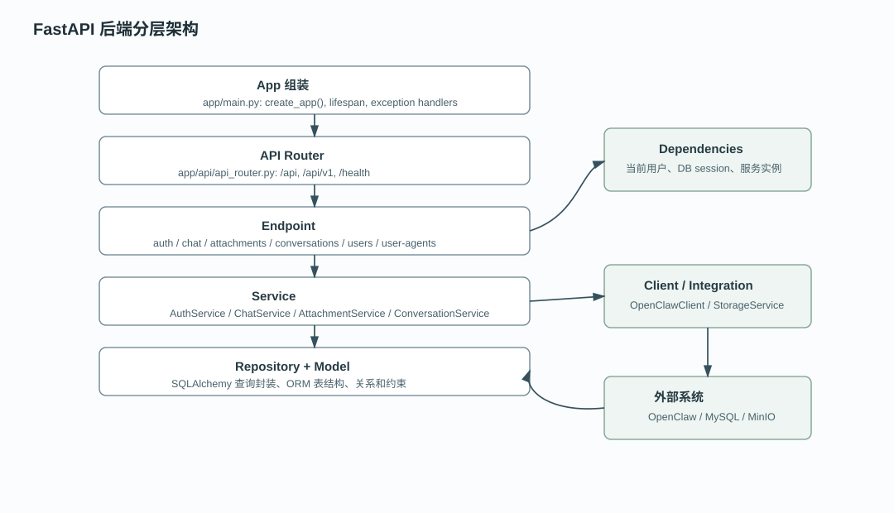
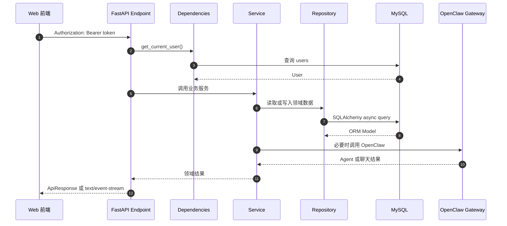
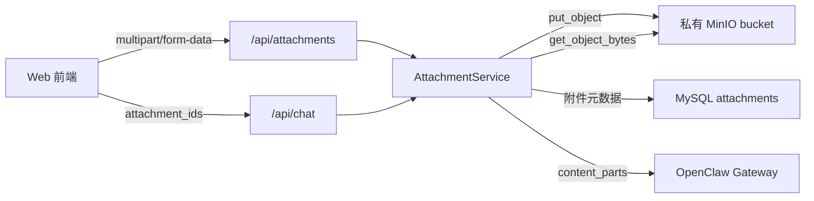

# 系统架构

## 1. 项目解决的问题

本后端为 Darwin Knowledge Platform 的 Web 端提供用户身份、Agent 绑定、聊天、会话历史和附件处理能力。它不是模型运行时，也不直接管理 OpenClaw 内部工作目录；它的职责是把前端请求转换为经过鉴权、校验、持久化和错误映射后的 OpenClaw Gateway 调用。

## 2. 系统总体架构

下图展示当前代码中的外部系统关系和主要数据流。



关键点：

- Web 前端只访问 FastAPI，不直接访问 MySQL、MinIO 或 OpenClaw Gateway。
- FastAPI 通过 SQLAlchemy 访问 MySQL，保存用户、Agent 绑定、会话、消息和附件元数据。
- 附件二进制存放在私有 MinIO bucket，数据库只保存 `bucket_name`、`object_key`、`sha256` 等元数据。
- OpenClaw Gateway 负责 Agent Provision、运行时就绪检查、普通聊天和流式聊天。

## 3. 后端分层



| 层级 | 职责 | 代表代码 |
| --- | --- | --- |
| FastAPI App | 应用创建、生命周期、全局中间件、异常处理注册 | `app/main.py` |
| API Router | 路由聚合和 URL 前缀组织 | `app/api/api_router.py` |
| Endpoint | HTTP 参数接收、依赖注入、响应封装 | `app/api/endpoints/*.py` |
| Dependency | 当前用户解析、服务实例组装、OpenClaw 客户端创建 | `app/api/dependencies.py` |
| Service | 业务规则、事务边界、跨模块编排 | `app/services/*.py` |
| Repository | SQLAlchemy 查询和持久化封装 | `app/repository/*.py` |
| Model | ORM 表结构和关系 | `app/models/*.py` |
| Client/Integration | OpenClaw Gateway、MinIO SDK 适配 | `app/clients/openclaw_client.py`, `app/integrations/minio_client.py` |

## 4. 核心请求流转



这条路径体现当前代码的主要分层：Endpoint 不直接拼 SQL 或 OpenClaw payload，业务编排集中在 Service，Repository 只处理持久化细节。

## 5. 同步请求与流式请求

普通 HTTP 请求返回统一 JSON 结构：

```json
{
  "code": 200,
  "msg": "success",
  "detail": "chat success",
  "data": {}
}
```

`POST /api/chat` 在 `stream=false` 时等待 OpenClaw 完整响应并返回 `ChatResponse`；在 `stream=true` 时返回 `StreamingResponse`，服务端通过 SSE 输出 `start`、`delta`、`done`、`error` 或 `cancelled` 事件。

## 6. 数据流和文件流



当前实现不向 OpenClaw 传 MinIO URL；附件内容由后端读取 bytes 后转成 Base64、文本片段或文件输入。

## 7. 设计原因

- 使用后端统一读取私有 MinIO 对象，可以避免把对象存储地址和权限暴露给前端或 OpenClaw。
- `user_id` 到 `agent_id` 的解析在后端完成，可以防止客户端越权指定其他用户的 Agent。
- 会话消息采用用户消息和 assistant 占位消息成对写入，便于流式请求最终把 assistant 消息落到 `completed`、`cancelled` 或 `error`。
- OpenClaw 错误先转换为内部异常，再映射为安全的 HTTP 响应，减少上游敏感信息泄露。

## 8. 已知限制

- `/api/v1/users` 和 `/api/v1/user-agents` 是管理类 CRUD，但当前没有鉴权或角色控制。
- `ChatStreamManager` 是进程内存状态，多进程部署或服务重启会丢失运行中/已完成流式请求状态。
- 无 `conversation_id` 的聊天不会持久化历史，也不会自动创建会话。
- 测试 fixture 当前使用 SQLite 手写 schema，和 README 中“测试必须使用 MySQL”的说明不一致。
- 没有 refresh token、登录失败限流、病毒扫描、OCR、异步附件解析和对象生命周期清理。

