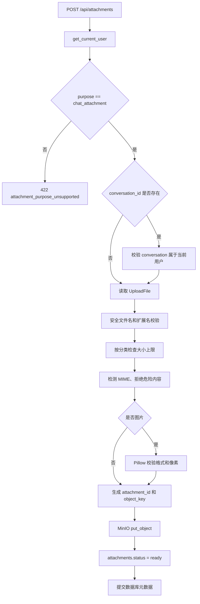
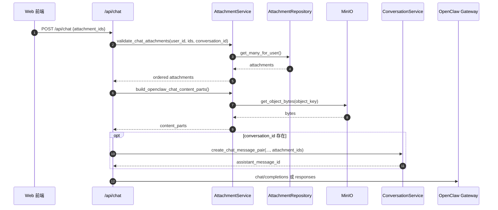
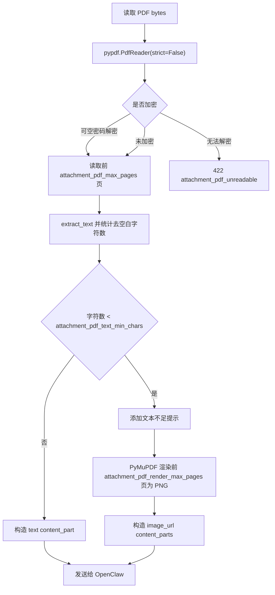
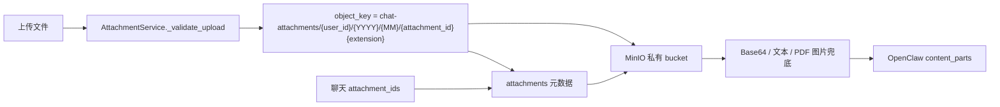

# 附件模块

## 1. 模块概述

附件模块支持聊天前上传文件，并在聊天请求中通过 `attachment_ids` 引用。后端负责文件合法性校验、MinIO 私有存储、数据库元数据保存、私有内容读取、消息关联，以及将附件转换为 OpenClaw 可接收的文本、图片或文件输入。

## 2. 业务目标

- 附件只属于上传用户，读取、删除和聊天引用都按 `user_id` 隔离。
- 文件内容不通过公开 URL 交给 OpenClaw，而由后端读取 bytes 后适配。
- 数据库保存元数据，MinIO 保存二进制，二者通过 `object_key` 关联。
- PDF 优先抽取文本，文本不足时把前几页渲染为图片作为兜底。

## 3. 当前实现状态

| 能力 | 状态 | 说明 |
| --- | --- | --- |
| multipart 上传 | 已实现 | `POST /api/attachments` |
| 私有内容读取 | 已实现 | `GET /api/attachments/{attachment_id}/content` |
| 未关联附件删除 | 已实现 | 已关联消息的附件不能删除 |
| 图片校验 | 已实现 | 检查 MIME、扩展名和像素上限 |
| 文本文档内联 | 已实现 | UTF-8/UTF-8-SIG 解码，不可解码时替换非法字符 |
| PDF 文本提取 | 已实现 | `pypdf.PdfReader` |
| PDF 图片兜底 | 已实现 | `PyMuPDF` 渲染前几页 PNG |
| OCR | 待实现 | 当前没有 OCR 组件 |
| 病毒扫描 | 待实现 | 当前仅做危险魔数和 SVG 拒绝 |

## 4. 核心概念

| 概念 | 代码名 | 当前值 |
| --- | --- | --- |
| 附件分类 | `AttachmentCategory` | `image`, `document` |
| 附件用途 | `AttachmentPurpose` | `chat_attachment` |
| 附件状态 | `AttachmentStatus` | `uploading`, `ready`, `failed`, `deleted` |
| 图片扩展名 | `IMAGE_EXTENSIONS` | `.jpg`, `.jpeg`, `.png`, `.webp` |
| 文档扩展名 | `DOCUMENT_EXTENSIONS` | `.pdf`, `.txt`, `.md`, `.csv`, `.json`, `.html`, `.htm` |

## 5. 目录与关键代码

| 路径 | 职责 |
| --- | --- |
| `app/api/endpoints/attachments.py` | 上传、详情、内容读取、删除接口 |
| `app/services/attachment_service.py` | 校验、存储、PDF 处理、OpenClaw 内容构造 |
| `app/services/storage_service.py` | MinIO bucket、put/get/delete 封装 |
| `app/integrations/minio_client.py` | MinIO SDK 客户端创建 |
| `app/repository/attachment_repository.py` | 附件元数据和消息关联查询 |
| `app/models/attachment.py` | `attachments` ORM |
| `app/models/message_attachment.py` | `message_attachments` ORM |
| `app/core/attachments.py` | 附件枚举、扩展名和 MIME 白名单 |

## 6. 数据模型

`attachments` 保存附件元数据：`id`、`user_id`、可选 `conversation_id`、`original_filename`、`bucket_name`、`object_key`、`content_type`、`detected_mime_type`、`extension`、`file_size`、`sha256`、`category`、`purpose`、`status`、`error_message`、审计字段和 `is_deleted`。

`message_attachments` 保存消息与附件的有序引用：`message_id`、`attachment_id`、`sort_order`。

## 7. 接口说明

### `POST /api/attachments`

认证：需要 Bearer Token。请求格式为 `multipart/form-data`。

| 字段 | 说明 |
| --- | --- |
| `file` | 必填上传文件 |
| `conversation_id` | 可选 UUID；如果提供，必须属于当前用户 |
| `purpose` | 默认 `chat_attachment`，当前只支持该值 |

响应数据来自 `AttachmentRead`：

```json
{
  "attachment_id": "00000000-0000-0000-0000-000000000001",
  "filename": "report.pdf",
  "content_type": "application/pdf",
  "file_size": 12345,
  "category": "document",
  "status": "ready",
  "preview_url": "/api/attachments/00000000-0000-0000-0000-000000000001/content"
}
```

### `GET /api/attachments/{attachment_id}`

返回附件详情，包括 `conversation_id`、`purpose`、`created_at`、`updated_at`。

### `GET /api/attachments/{attachment_id}/content`

后端鉴权后从 MinIO 读取 bytes 并转发。图片使用 `Content-Disposition: inline`，文档使用 `attachment`，响应带 `Cache-Control: private, max-age=300`。

### `DELETE /api/attachments/{attachment_id}`

只允许删除未被 `message_attachments` 引用的附件。删除时先调用 MinIO `remove_object`，再把数据库记录标记为 `is_deleted=True` 和 `status=deleted`。

## 8. 上传流程



## 9. 聊天引用附件时序



## 10. PDF 处理决策流程



当前阈值来自配置项：`ATTACHMENT_PDF_TEXT_MIN_CHARS`，默认 `120`。读取页数上限为 `ATTACHMENT_PDF_MAX_PAGES`，默认 `20`；图片兜底渲染页数上限为 `ATTACHMENT_PDF_RENDER_MAX_PAGES`，默认 `3`。

## 11. MinIO、数据库和 OpenClaw 数据流



## 12. 支持和不支持的文件类型

| 类型 | 支持扩展名 | MIME 校验 |
| --- | --- | --- |
| 图片 | `.jpg`, `.jpeg`, `.png`, `.webp` | 根据文件头检测并用 Pillow 验证 |
| 文本/结构化文本 | `.txt`, `.md`, `.csv`, `.json`, `.html`, `.htm` | UTF-8 样本或 JSON 解析 |
| PDF | `.pdf` | `%PDF-` 文件头，随后用 pypdf 解析 |

当前拒绝 `MZ`、ELF、ZIP 文件头和以 `<svg` 开头的内容；这不是完整病毒扫描。

## 13. 配置项

| 配置项 | 用途 |
| --- | --- |
| `MINIO_ENDPOINT` | MinIO 地址 |
| `MINIO_ACCESS_KEY` | MinIO access key |
| `MINIO_SECRET_KEY` | MinIO secret key |
| `MINIO_BUCKET_CHAT_ATTACHMENTS` | 聊天附件 bucket |
| `MINIO_SECURE` | 是否使用 HTTPS |
| `MINIO_REGION` | 可选 region |
| `ATTACHMENT_IMAGE_MAX_SIZE` | 单张图片大小上限 |
| `ATTACHMENT_DOCUMENT_MAX_SIZE` | 单个文档大小上限 |
| `ATTACHMENT_TOTAL_MAX_SIZE` | 单条消息附件总大小上限 |
| `ATTACHMENT_MAX_COUNT` | 单条消息附件数量上限 |
| `ATTACHMENT_IMAGE_MAX_PIXELS` | 图片像素上限 |
| `ATTACHMENT_INLINE_TEXT_MAX_CHARS` | 文本内联字符上限 |
| `ATTACHMENT_PDF_MAX_PAGES` | PDF 文本抽取页数上限 |
| `ATTACHMENT_PDF_TEXT_MIN_CHARS` | PDF 触发图片兜底的最小有效文本字符数 |
| `ATTACHMENT_PDF_RENDER_MAX_PAGES` | PDF 图片兜底渲染页数上限 |
| `ATTACHMENT_PDF_RENDER_ZOOM` | PDF 渲染缩放 |

## 14. 异常处理

| code | HTTP 状态 | 场景 |
| --- | --- | --- |
| `attachment_purpose_unsupported` | 422 | 非 `chat_attachment` 用途 |
| `attachment_type_unsupported` | 415 | 扩展名、分类或危险内容不支持 |
| `attachment_empty` | 400 | 空文件 |
| `attachment_too_large` | 413 | 单文件超限 |
| `attachment_total_size_exceeded` | 413 | 单条消息附件总大小超限 |
| `attachment_mime_mismatch` | 415 | 扩展名、声明 MIME 与检测 MIME 不匹配 |
| `attachment_storage_failed` | 503 | MinIO 上传失败且对象未写入 |
| `attachment_not_found` | 404 | 附件不存在或不属于当前用户 |
| `attachment_not_ready` | 409 | 附件状态不是 `ready` |
| `attachment_conversation_mismatch` | 409 | 附件绑定的 conversation 与请求不一致 |
| `attachment_already_linked` | 409 | 附件已经关联消息，不能删除 |
| `attachment_pdf_unreadable` | 422 | PDF 无法读取或需要密码 |
| `attachment_pdf_render_failed` | 422 | PDF 页面渲染失败 |

## 15. 安全边界

- 不写入真实 MinIO 密钥到文档或响应。
- `get_for_user()` 和 `get_many_for_user()` 都带 `user_id` 条件。
- 私有文件内容只由后端鉴权后转发。
- `object_key` 包含 `user_id`、年月和 `attachment_id`，但对外 API 只暴露 `attachment_id`。
- 当前未实现病毒扫描、DLP、内容审核和临时签名 URL。

## 16. 测试覆盖

`tests/test_attachments.py` 覆盖上传、读取、删除、PDF 解析、PDF 图片兜底、附件用户隔离、无文本附件聊天、数量和大小限制、上传失败和 OpenClaw 失败安全性。

## 17. 后续演进方向

- 增加 OCR，用于扫描件 PDF 和图片文本理解。
- 增加大文件异步解析与解析缓存。
- 增加文件预览、缩略图和对象生命周期清理。
- 增加病毒扫描和更完整的 MIME 检测。
- 为 `failed` 附件状态补充异步处理失败场景，目前上传失败多数直接返回错误，不落 `failed` 记录。

