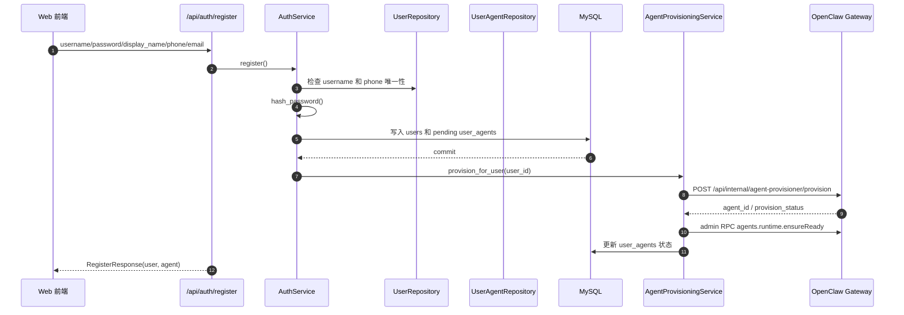
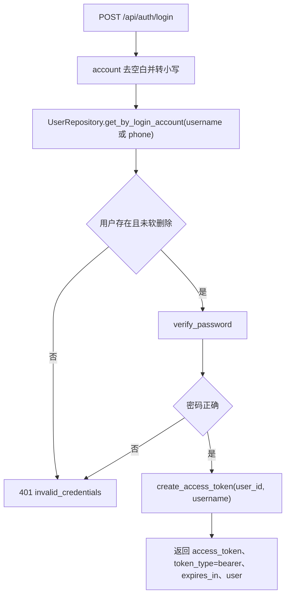
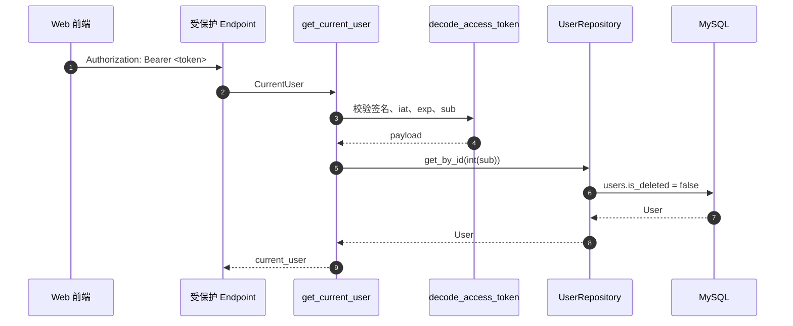

# 认证模块

## 1. 模块概述

认证模块提供注册、登录和当前用户查询。注册时会创建 `users` 记录、默认 `user_agents` 记录，并尝试调用 OpenClaw Gateway 完成 Agent Provision。登录成功后返回 JWT Access Token，后续受保护接口通过 Bearer Token 解析当前用户。

## 2. 业务目标

- 密码只保存 Argon2 哈希，不保存明文。
- API 和 JWT 中的 Snowflake 用户 ID 使用十进制字符串，避免浏览器大整数精度问题。
- 登录失败统一返回相同错误信息，减少账号枚举风险。
- 注册成功后尽量自动准备用户专属 OpenClaw Agent。

## 3. 当前实现状态

| 能力 | 状态 | 说明 |
| --- | --- | --- |
| 注册 | 已实现 | `POST /api/auth/register` |
| 登录 | 已实现 | `POST /api/auth/login` |
| 当前用户 | 已实现 | `GET /api/auth/me` |
| 密码哈希 | 已实现 | `pwdlib.PasswordHash.recommended()`，当前为 Argon2 |
| JWT Access Token | 已实现 | `sub` 为字符串形式 user id |
| Refresh Token | 待实现 | 当前只有 access token |
| 登录失败限流 | 待实现 | 当前没有限流或锁定 |

## 4. 目录与关键代码

| 路径 | 职责 |
| --- | --- |
| `app/api/endpoints/auth.py` | 注册、登录、当前用户接口 |
| `app/services/auth_service.py` | 注册和登录业务编排 |
| `app/core/security.py` | 密码哈希、密码校验、JWT 创建与解析 |
| `app/api/dependencies.py` | `get_current_user()` Bearer Token 解析 |
| `app/schemas/auth.py` | 认证请求和响应结构 |
| `app/schemas/ids.py` | Snowflake ID 字符串序列化 |

## 5. 注册流程

注册时如果 OpenClaw 调用失败，当前代码保留用户和 `user_agents` 记录，并把 Agent 状态更新为 `failed`。公共响应会隐藏内部失败原因，使用安全错误文本。

## 6. 登录流程

## 7. 鉴权时序

## 8. 主要请求和响应

`UserRegisterRequest`：

| 字段 | 规则 |
| --- | --- |
| `username` | 3-64，允许字母、数字、下划线、点和连字符 |
| `password` | 8-128 |
| `display_name` | 1-128 |
| `phone` | 可选，6-32，允许可选 `+` 和数字 |
| `email` | 可选，Email |

`UserLoginRequest`：

| 字段 | 规则 |
| --- | --- |
| `account` | username 或 phone，1-64 |
| `password` | 1-128 |

Token 配置：

| 配置项 | 用途 |
| --- | --- |
| `JWT_SECRET_KEY` | JWT 签名密钥 |
| `JWT_ALGORITHM` | 当前默认 `HS256` |
| `JWT_ACCESS_TOKEN_EXPIRE_MINUTES` | Access Token 有效分钟数，默认 `120` |

## 9. 常见认证错误

| code | HTTP 状态 | 场景 |
| --- | --- | --- |
| `invalid_credentials` | 401 | 登录账号不存在或密码错误 |
| `invalid_token` | 401 | Token 缺失、不是 Bearer、签名无效、过期、`sub` 非正整数字符串或用户不存在 |
| `username_conflict` | 409 | 注册用户名已存在，包括软删除记录 |
| `phone_conflict` | 409 | 注册手机号已存在，包括软删除记录 |
| `user_conflict` | 409 | 数据库唯一性冲突但无法精确判断字段 |

## 10. 权限边界

当前所有使用 `CurrentUser` 的接口都基于 Bearer Token 做用户身份隔离。需要注意：`/api/v1/users` 和 `/api/v1/user-agents` 是历史或管理类接口，当前代码没有接入 `CurrentUser`，也没有角色权限控制。

## 11. 测试覆盖

`tests/test_auth.py` 覆盖注册密码哈希、敏感字段隐藏、唯一性冲突、Snowflake ID、注册事务回滚、登录账号类型、登录失败统一消息、`/me` token 校验、过期 token 和软删除用户。

## 12. 当前安全限制

- 没有 refresh token 和 token 撤销列表。
- 没有登录失败次数限制、IP 限流或设备管理。
- Access Token 签发后在过期前无法服务端主动撤销。
- 管理类 CRUD 接口缺少认证和角色边界。

## 13. 后续改进

- 增加 refresh token、token rotation 和服务端撤销能力。
- 为登录、注册和 Agent Provision 增加限流。
- 为管理接口增加 RBAC 或至少内部网关鉴权。
- 增加审计日志，记录认证关键事件但不记录密码或 token。

