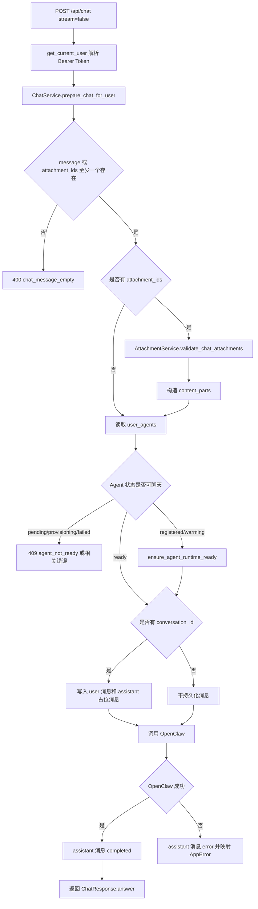
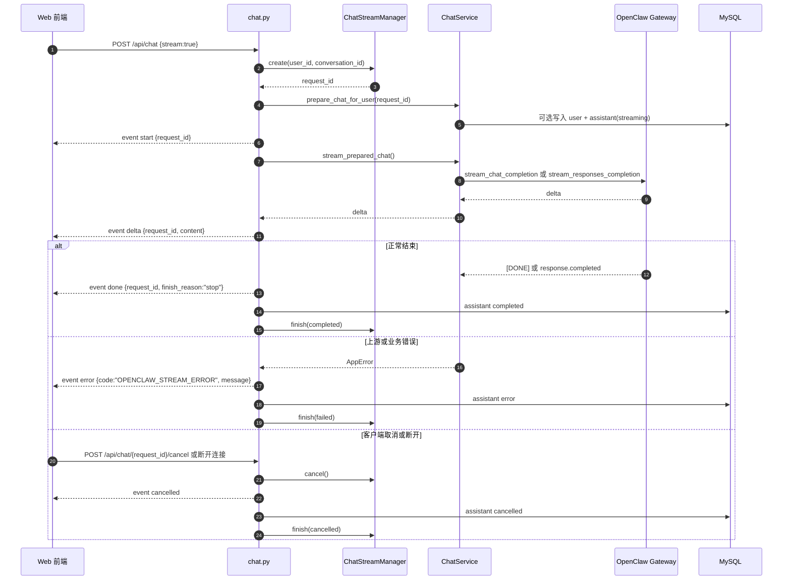

# 聊天模块

## 1. 模块概述

聊天模块提供 `POST /api/chat` 和 `POST /api/chat/{request_id}/cancel`。它负责解析当前用户、校验消息与附件、查找用户绑定的 OpenClaw Agent、选择 OpenClaw 调用方式，并在传入 `conversation_id` 时写入会话消息历史。

## 2. 业务目标

- 用户只能使用自己绑定的 `user_agents.agent_id`，不能从请求体传入或覆盖 Agent。
- 普通聊天和 SSE 流式聊天共用同一套准备逻辑。
- 附件内容在后端从 MinIO 读取并转换为 OpenClaw 输入。
- 会话内聊天保证同一会话同一时间只有一个活跃生成。
- OpenClaw 错误被映射为安全的 HTTP 或 SSE 错误事件。

## 3. 当前实现状态

| 能力 | 状态 | 说明 |
| --- | --- | --- |
| 普通聊天 | 已实现 | `stream=false` 时返回 `ApiResponse[ChatResponse]` |
| SSE 流式聊天 | 已实现 | 输出 `start`、`delta`、`done`、`error`、`cancelled` |
| 停止生成 | 已实现 | 进程内 `ChatStreamManager` 取消任务 |
| 会话消息持久化 | 已实现 | 仅当请求携带 `conversation_id` |
| 无会话临时聊天 | 已实现 | 不自动创建 conversation，不写消息表 |
| 多进程流式状态共享 | 待实现 | 当前为进程内内存 |

## 4. 核心概念

| 概念 | 代码名 | 说明 |
| --- | --- | --- |
| 聊天请求 | `ChatRequest` | `message`、`attachment_ids`、`stream`、`conversation_id` |
| 准备后的请求 | `PreparedChatRequest` | 包含 `agent_id`、`session_key`、`content_parts`、`assistant_message_id` |
| 流式请求记录 | `ChatStreamRecord` | 保存 `request_id`、`user_id`、`conversation_id`、状态和任务 |
| 消息状态 | `ConversationMessageStatus` | `pending`、`streaming`、`completed`、`cancelled`、`error` |
| Agent 状态 | `ProvisionStatus` | `pending`、`provisioning`、`registered`、`warming`、`ready`、`failed` |

## 5. 目录与关键代码

| 路径 | 职责 |
| --- | --- |
| `app/api/endpoints/chat.py` | HTTP 接口、SSE 输出、取消生成 |
| `app/services/chat_service.py` | 聊天准备、OpenClaw 调用、错误映射、消息最终态保存 |
| `app/services/chat_stream_manager.py` | 进程内流式请求状态和取消控制 |
| `app/services/conversation_service.py` | 会话消息对写入和 assistant 消息最终态 |
| `app/services/attachment_service.py` | 附件校验和 OpenClaw 内容适配 |
| `app/clients/openclaw_client.py` | OpenClaw chat completions、responses 和流式事件解析 |
| `app/schemas/chat.py` | 请求和响应结构 |

## 6. 数据模型

聊天模块主要写入 `conversations`、`conversation_messages` 和 `message_attachments`。当 `conversation_id` 存在时，`ConversationService.create_chat_message_pair()` 会写入一条 `role=user`、`status=completed` 的用户消息，以及一条 `role=assistant` 的占位消息。普通聊天的 assistant 初始状态为 `pending`，流式聊天为 `streaming`。

无 `conversation_id` 时不会写入 `conversation_messages`，也不会关联附件到消息。

## 7. 接口说明

### `POST /api/chat`

认证：需要 `Authorization: Bearer <token>`。

请求体：

```json
{
  "message": "请总结这份材料",
  "attachment_ids": ["00000000-0000-0000-0000-000000000001"],
  "stream": false,
  "conversation_id": "00000000-0000-0000-0000-000000000000"
}
```

字段规则：

| 字段 | 规则 |
| --- | --- |
| `message` | 字符串，去首尾空白，最长 10000；如果不带附件则不能为空 |
| `attachment_ids` | 字符串列表，默认空列表 |
| `stream` | 严格布尔值，默认 `false` |
| `conversation_id` | 可选 UUID 字符串 |

同步响应：

```json
{
  "code": 200,
  "msg": "success",
  "detail": "chat success",
  "data": {
    "answer": "OpenClaw 返回的回答"
  }
}
```

### `POST /api/chat/{request_id}/cancel`

认证：需要 Bearer Token。只允许取消当前用户自己的请求；找不到或不是本人请求时返回 `chat_stream_not_found`。

响应数据：

```json
{
  "request_id": "stream-request-uuid",
  "status": "cancelling"
}
```

## 8. 普通聊天流程



## 9. SSE 流式聊天时序



## 10. OpenClaw 请求构造

`ChatService` 根据附件情况决定 OpenClaw 调用：

| 情况 | OpenClaw 方法 |
| --- | --- |
| 无附件 | `chat_completion()` 或 `stream_chat_completion()` |
| 图片、PDF、txt、md、csv、json、html、htm | 当前均可构造为 `/v1/chat/completions` 的 `content_parts` |
| 文档附件且扩展名不在 `CHAT_INLINE_DOCUMENT_EXTENSIONS` | 代码已预留 `/v1/responses` 分支；按当前允许扩展名通常不会触发 |

`session_key` 规则：

- 有 `conversation_id`：`webchat:{conversation_id}`
- 无 `conversation_id` 但有流式 `request_id`：`webchat:{request_id}`
- 其他情况：`webchat:{uuid4()}`

## 11. 依赖模块

- 认证：`get_current_user()`
- Agent：`UserAgentRepository`、`OpenClawClient.ensure_agent_runtime_ready()`
- 会话：`ConversationService`
- 附件：`AttachmentService`
- 上游：`OpenClawClient`

## 12. 常见错误

| code | HTTP 状态 | 场景 |
| --- | --- | --- |
| `invalid_token` | 401 | Bearer Token 缺失、过期、篡改或用户不存在 |
| `chat_message_empty` | 400 | 消息和附件同时为空 |
| `user_agent_not_found` | 404 | 当前用户没有可用 Agent 绑定 |
| `agent_not_ready` | 409 或 503 | Agent 未创建或运行时仍在预热 |
| `agent_provisioning` | 409 | Agent 正在创建 |
| `agent_provision_failed` | 409 | Agent 创建失败 |
| `conversation_generation_running` | 409 | 同一会话已有活跃生成 |
| `attachment_not_found` | 404 | 附件不存在或不属于当前用户 |
| `openclaw_timeout` | 504 | 等待 OpenClaw 超时 |
| `openclaw_unavailable` | 503 | 无法连接 OpenClaw |

SSE 模式下，业务或上游错误会尽量以 `event: error` 返回，`data.code` 固定为 `OPENCLAW_STREAM_ERROR`，消息内容来自安全映射后的错误消息。

## 13. 测试覆盖

相关测试位于 `tests/test_chat.py`、`tests/test_chat_service.py`、`tests/test_conversations.py`、`tests/test_attachments.py` 和 `tests/clients/test_openclaw_client.py`。覆盖同步聊天、SSE 事件、取消生成、用户隔离、Agent 状态、OpenClaw 错误映射、会话持久化和附件聊天。

## 14. 当前限制

- `ChatStreamManager` 不是分布式状态，不适合多 Uvicorn worker 共享取消状态。
- 没有 token 使用统计、上下文裁剪或模型选择配置。
- 无会话聊天不会持久化，前端如果需要历史必须先创建 conversation。
- SSE 取消依赖当前进程中的 `request_id` 记录，服务重启后无法继续取消旧请求。

## 15. 后续改进

- 将流式请求状态迁移到 Redis 或数据库，支持多实例。
- 为 OpenClaw 请求增加 token 统计、上下文裁剪和请求追踪 ID。
- 增加聊天中断恢复和 assistant 消息续写策略。
- 增加更细粒度的上游错误码透传规范，但继续避免泄露内部路径和 token。

