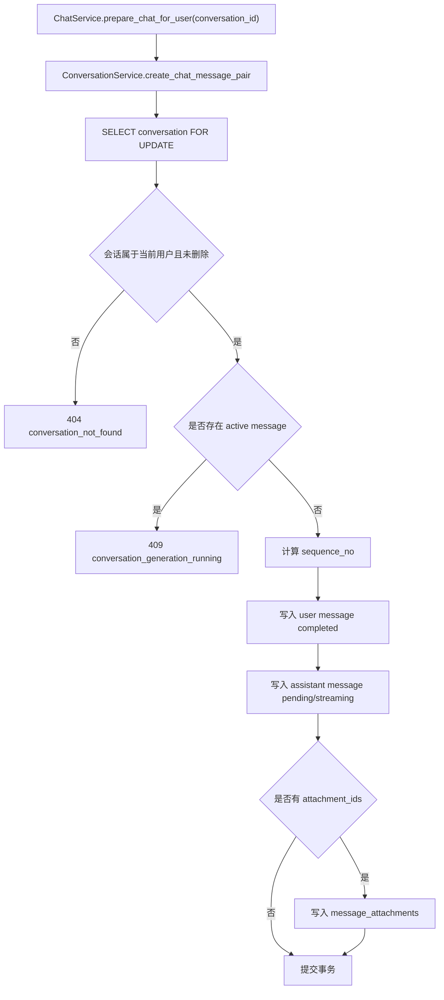
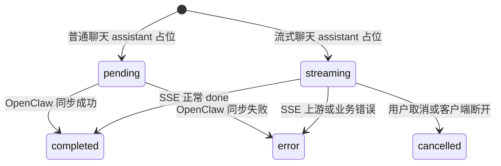

# 会话模块

## 1. 模块概述

会话模块维护用户的聊天会话、消息历史和消息附件引用。它不负责调用 OpenClaw；聊天调用由 [聊天模块](chat.md) 处理，持久化时复用 `ConversationService`。

## 2. 当前实现状态

| 能力 | 状态 | 接口 |
| --- | --- | --- |
| 创建会话 | 已实现 | `POST /api/conversations` |
| 会话列表 | 已实现 | `GET /api/conversations` |
| 会话详情 | 已实现 | `GET /api/conversations/{conversation_id}` |
| 消息列表 | 已实现 | `GET /api/conversations/{conversation_id}/messages` |
| 更新标题 | 已实现 | `PATCH /api/conversations/{conversation_id}` |
| 软删除会话 | 已实现 | `DELETE /api/conversations/{conversation_id}` |
| 会话搜索 | 待实现 | 无 |
| 会话归档 | 待实现 | 当前只有软删除 |

## 3. 关键代码

| 路径 | 职责 |
| --- | --- |
| `app/api/endpoints/conversations.py` | 会话和消息历史接口 |
| `app/services/conversation_service.py` | 会话业务规则、消息对写入、最终态保存 |
| `app/repository/conversation_repository.py` | 会话和消息查询 |
| `app/models/conversation.py` | `conversations` ORM |
| `app/models/conversation_message.py` | `conversation_messages` ORM |
| `app/models/message_attachment.py` | 消息附件关联 ORM |

## 4. 核心规则

- 会话 ID 使用 UUID 字符串。
- `ConversationStatus` 当前只有 `active`。
- 默认标题是 `新对话`。
- 第一条聊天消息写入时，如果标题仍是默认值，会用用户消息前 30 个字符自动生成标题。
- 会话列表使用 offset cursor，`cursor` 必须是十进制字符串。
- 删除会话前会检查是否有 `pending` 或 `streaming` 消息；有活跃生成时拒绝删除。

## 5. 会话消息写入流程

## 6. 消息最终态

终态集合由 `TERMINAL_MESSAGE_STATUSES` 定义：`completed`、`cancelled`、`error`。

## 7. 消息历史中的附件

`GET /api/conversations/{conversation_id}/messages` 会先读取消息，再通过 `AttachmentRepository.list_for_message_ids()` 获取 `MessageAttachment`，并过滤 `link.attachment.is_deleted` 的附件。返回结构中的消息 ID 使用字符串形式，避免前端大整数精度问题。

## 8. 常见错误

| code | HTTP 状态 | 场景 |
| --- | --- | --- |
| `conversation_not_found` | 404 | 会话不存在、已软删除或不属于当前用户 |
| `invalid_conversation_cursor` | 422 | 列表 cursor 不是十进制字符串 |
| `conversation_title_empty` | 422 | 标题为空 |
| `conversation_title_too_long` | 422 | 标题超过 100 个字符 |
| `conversation_active_stream` | 409 | 删除会话时仍有活跃生成 |
| `conversation_generation_running` | 409 | 聊天写入消息对时同会话已有活跃生成 |
| `conversation_message_conflict` | 409 | 消息序号等写入冲突 |

## 9. 测试覆盖

`tests/test_conversations.py` 覆盖会话 CRUD、用户隔离、列表排序、聊天持久化、流式完成/错误持久化、删除或外部会话不可访问、活跃生成冲突和 UUID 校验。

## 10. 后续改进

- 增加归档状态，与软删除区分。
- 增加搜索、置顶、批量删除和分页游标优化。
- 增加 conversation 级统计字段，例如消息数、附件数和 token 使用量。

