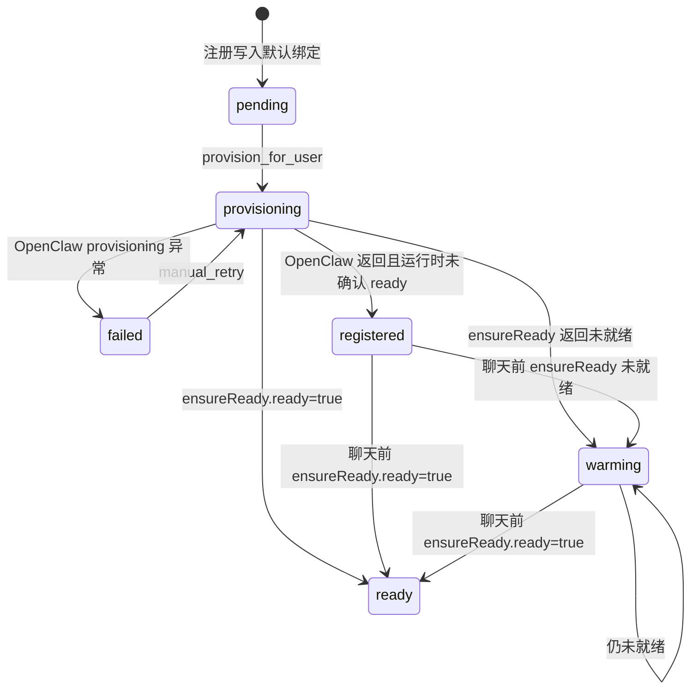
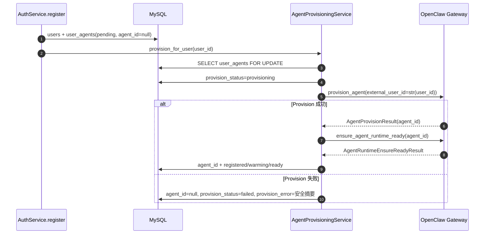
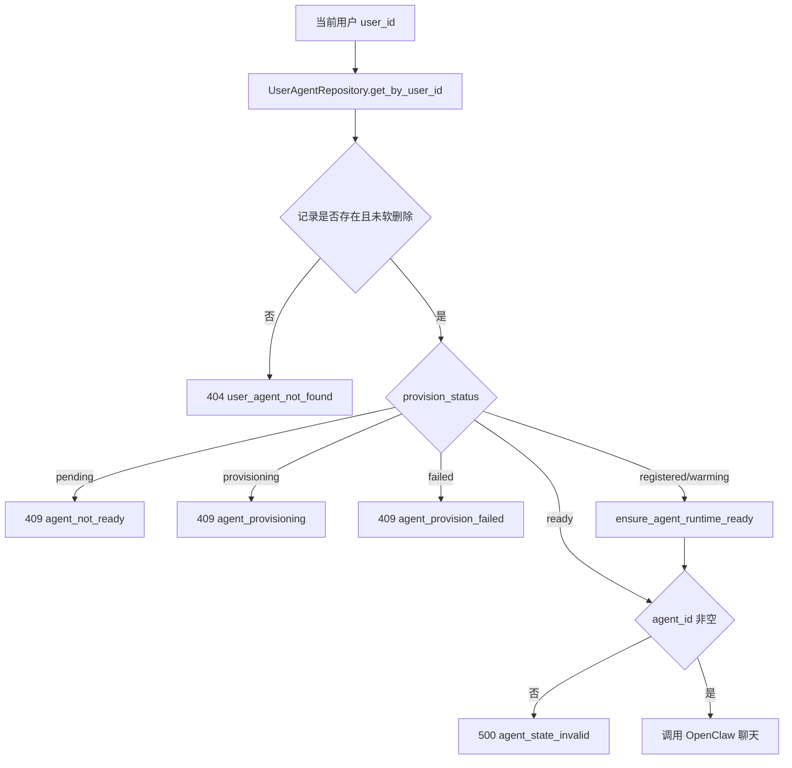
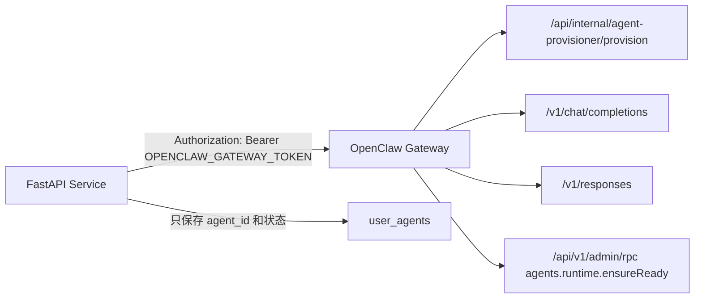

# OpenClaw Agent 模块

## 1. 模块概述

OpenClaw Agent 模块维护平台用户与 OpenClaw Agent 的一对一绑定。绑定记录保存在 `user_agents` 表，聊天前由后端根据当前 `user_id` 查询 `agent_id`，再调用 OpenClaw Gateway。

当前协议中，Provision 成功响应只使用 `agent_id`、`provision_status`、`agent_ready`、`requires_gateway_restart` 和 `retry_after_ms` 等公开字段。历史迁移中曾出现 `workspace_path`、`agent_dir`、`knowledge_path`，但当前 ORM 和响应模型已经移除，不应向外部暴露这些内部路径。

## 2. 业务目标

- 每个用户最多绑定一个 OpenClaw Agent。
- 每个 `agent_id` 最多绑定一个用户。
- 注册后自动创建 Agent，失败不回滚平台用户。
- 手动重试只能操作当前用户自己的 Agent 绑定。
- 聊天前检查 Agent 状态，必要时调用运行时就绪检查。

## 3. 当前实现状态

| 能力 | 状态 | 说明 |
| --- | --- | --- |
| 用户注册后创建默认绑定 | 已实现 | 初始 `provision_status=pending`, `agent_id=None` |
| 自动 Provision | 已实现 | `AuthService.register()` 调用 `AgentProvisioningService` |
| 手动重试 | 已实现 | `POST /api/user-agents/me/provision` |
| 当前用户 Agent 查询 | 已实现 | `GET /api/user-agents/me` |
| 管理 CRUD | 已实现，未鉴权 | `/api/v1/user-agents` |
| 定时状态同步 | 待实现 | 当前只在注册、手动重试、聊天前检查 |

## 4. 状态流转

`AgentProvisioningService._status()` 兼容历史状态 `creating`，会将其视为 `pending`。

## 5. 目录与关键代码

| 路径 | 职责 |
| --- | --- |
| `app/api/endpoints/user_agent.py` | 当前用户 Agent 接口和管理 CRUD |
| `app/services/agent_provision_service.py` | Provision 状态机、OpenClaw 调用、失败收敛 |
| `app/services/user_agent_service.py` | UserAgent CRUD 业务规则 |
| `app/repository/user_agent_repository.py` | UserAgent 查询、锁定、唯一性 |
| `app/clients/openclaw_client.py` | Provision 和 `ensure_agent_runtime_ready()` |
| `app/core/provisioning.py` | 状态枚举和公共错误文本 |
| `app/schemas/user_agent.py` | UserAgent 响应和内部错误隐藏 |

## 6. 用户注册与 Agent Provision 时序

## 7. 聊天时 user_id 到 agent_id 的解析

## 8. FastAPI 与 OpenClaw 集成边界

## 9. OpenClaw 调用协议

| 方法 | 路径 | 用途 |
| --- | --- | --- |
| `provision_agent()` | `/api/internal/agent-provisioner/provision` | 创建或获取用户 Agent |
| `ensure_agent_runtime_ready()` | `/api/v1/admin/rpc`，method 为 `agents.runtime.ensureReady` | 检查 Agent 运行时是否可聊天 |
| `chat_completion()` | `/v1/chat/completions` | 普通聊天 |
| `stream_chat_completion()` | `/v1/chat/completions` | 流式聊天 |
| `responses_completion()` | `/v1/responses` | 预留给文件型输入 |
| `stream_responses_completion()` | `/v1/responses` | 预留给文件型流式输入 |

## 10. 配置项

| 配置项 | 用途 |
| --- | --- |
| `OPENCLAW_BASE_URL` | OpenClaw Gateway 地址 |
| `OPENCLAW_GATEWAY_TOKEN` | Gateway 鉴权 token |
| `OPENCLAW_CONNECT_TIMEOUT_SECONDS` | 连接超时 |
| `OPENCLAW_READ_TIMEOUT_SECONDS` | 读取超时 |
| `OPENCLAW_WRITE_TIMEOUT_SECONDS` | 写入超时 |
| `OPENCLAW_POOL_TIMEOUT_SECONDS` | 连接池等待超时 |

## 11. 失败恢复机制

当前失败恢复以“显式重试”为主：

- 注册时 Provision 失败：用户保留，`user_agents.provision_status=failed`，可通过 `POST /api/user-agents/me/provision` 重试。
- Provision 正在进行：重复请求会返回 `agent_provisioning_in_progress`。
- 已经是 `registered`、`warming` 或 `ready`：手动 Provision 调用保持幂等，不重复创建。
- 聊天前运行时未就绪：会更新状态为 `warming` 或 `registered`，并返回包含 `retry_after_ms` 的 503。

## 12. 安全边界

- 不接受客户端传入 `agent_id` 进行聊天。
- 对公众响应隐藏内部 Provision 错误，`failed` 状态返回 `SAFE_PUBLIC_PROVISION_ERROR`。
- OpenClaw Gateway token 只存在配置中，不写入响应。
- 当前不应恢复或暴露历史迁移中的 `workspace_path`、`agent_dir`、`knowledge_path`。

## 13. 测试覆盖

`tests/test_agent_provisioning.py` 覆盖注册自动创建、运行时未就绪、OpenClaw 超时/连接失败/鉴权失败/无效响应、手动重试、幂等和当前用户隔离。`tests/test_user_agent.py` 覆盖当前用户 Agent 查询和敏感字段不返回。

## 14. 后续改进

- 增加后台状态同步任务，周期性刷新 `registered` 和 `warming` Agent。
- 增加带退避的自动重试和失败告警。
- 把 Provision 操作从注册请求中拆到异步队列，避免注册等待上游。
- 增加 Agent 状态审计历史表。

