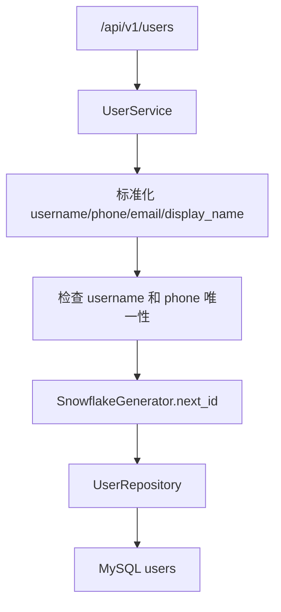

# 用户模块

## 1. 模块概述

用户模块维护平台用户资料。当前有两组入口：认证相关接口在 `/api/auth/*`，管理类 User CRUD 在 `/api/v1/users`。注册和登录应优先参考 [认证模块](auth.md)。

## 2. 当前实现状态

| 能力 | 状态 | 说明 |
| --- | --- | --- |
| 创建用户 | 已实现 | `POST /api/v1/users` |
| 用户列表 | 已实现 | `GET /api/v1/users` |
| 用户详情 | 已实现 | `GET /api/v1/users/{user_id}` |
| 更新用户 | 已实现 | `PATCH /api/v1/users/{user_id}` |
| 软删除用户 | 已实现 | `DELETE /api/v1/users/{user_id}` |
| 管理权限 | 待实现 | 当前 CRUD 未接入认证依赖 |

## 3. 关键代码

| 路径 | 职责 |
| --- | --- |
| `app/api/endpoints/user.py` | `/api/v1/users` CRUD |
| `app/services/user_service.py` | 用户业务规则和事务 |
| `app/repository/user_repository.py` | 用户查询和软删除 |
| `app/models/user.py` | `users` ORM |
| `app/schemas/user.py` | 请求和响应模型 |

## 4. 数据模型

`users.id` 是应用生成的 63-bit Snowflake ID，ORM 类型为 `BigInteger`，`autoincrement=False`。API 响应通过 `SnowflakeId` 序列化为字符串。

关键唯一约束：

- `uk_users_username`
- `uk_users_phone`

软删除字段来自 `SoftDeleteMixin.is_deleted`。唯一性校验使用 `include_deleted=True`，因此软删除用户仍占用 `username` 和 `phone`。

## 5. 用户 CRUD 流程

## 6. 当前限制

- `/api/v1/users` 当前没有 `CurrentUser` 依赖，也没有管理员角色判断。
- `UserService.create()` 不设置 `password_hash`，但 `User` ORM 要求非空；因此该管理创建接口在当前模型下存在待确认问题，注册路径应使用 `AuthService.register()`。
- 用户删除是软删除，不级联删除 `user_agents`、`conversations` 或 `attachments`。

## 7. 后续改进

- 明确 `/api/v1/users` 是内部管理接口还是废弃接口。
- 如果保留管理创建用户，需要补充密码设置或禁用登录能力。
- 增加管理员鉴权、审计日志和用户恢复策略。

